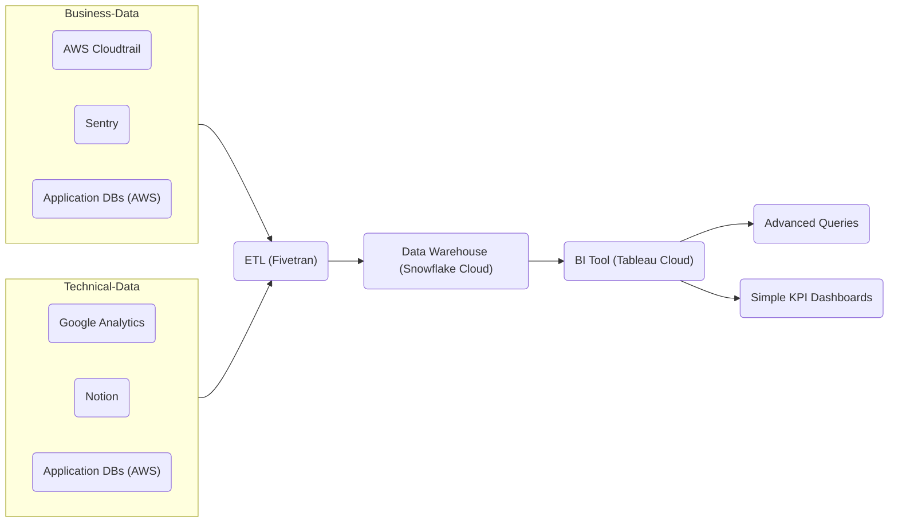

# Analytics

This combines multiple modules, namely:

* [Snowflake](../snowflake/cloud/README.md)
* [Fivetran](../fivetran/README.md)
* [AWS Secrets](../secrets/README.md)
* Tableau (TODO: can we terraform this?)

## Usage

Copy paste the `secrets.json` file into your terraform script folder and **gitignore** it.
Then add all credentials that you want to have pre-populated. Later, you will have to edit secrets directly in the AWS Secrets Vault.


```terraform
module "awesome-module" {
  source = "github.com/dbl-works/terraform//analytics?ref=v2021.07.05"

  # Required
  environment = "staging"
  project     = "someproject"
}
```

## Concepts


The following Mermaid graph visualized the concept of why we need this module:




Fivetran needs access to the Snowflake Data Warehouse.
Snowflake should disallow any access and maintain an explicit alowlist.

Fivetran IP addresses: https://fivetran.com/docs/getting-started/ips#euregions

EU IP Addresses:

| PROVIDER | REGION                   | IP ADDRESSES (CIDR) | IP ADDRESSES (RANGE)              |
|----------|--------------------------|---------------------|-----------------------------------|
| AWS      | eu-west-1 (Dublin)       | `3.251.214.192/29`  | `3.251.214.192` - `3.251.214.199` |
| AWS      | eu-central-1 (Frankfurt) | `3.67.81.32/29`     | `3.67.81.32` - `3.67.81.39`       |
| GCP      | europe-west3 (Frankfurt) | `35.235.32.144/29`  | `35.235.32.144` - `35.235.32.151` |
| Azure    | westeurope (Netherlands) | `20.31.74.16/29`    | `20.31.74.16` - `20.31.74.23`     |
