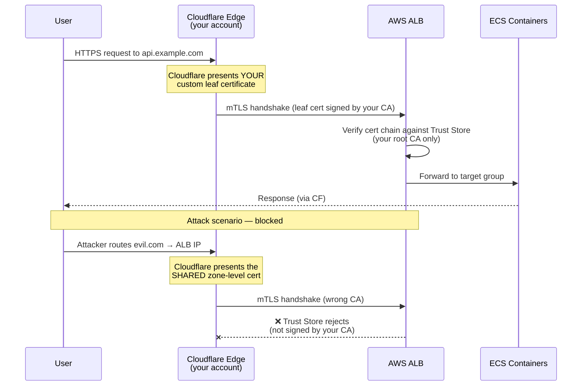

# AWS ALB mTLS (Trust Store) Module

This module provisions an AWS ALB Trust Store to enable mTLS (mutual TLS) authentication on an ALB listener. This is particularly useful for implementing **Cloudflare Authenticated Origin Pulls**.

## Overview

AWS ALB Trust Stores (`aws_lb_trust_store`) are required for verifying incoming client certificates (such as the certificate Cloudflare presents when proxying traffic to your origin). 

**Important limitation:** Trust Stores cannot use AWS Certificate Manager (ACM). ACM only stores *server* certificates (what the ALB presents to clients). Trust Stores *must* read CA certificate bundles from S3. This module creates a minimal, locked-down S3 bucket to store the provided CA bundle and creates the Trust Store from it.

## ⚠️ Rollout Warning

When enabling mTLS on an *existing* ALB, **deployment order matters**:
Adding `mutual_authentication` with `mode = "verify"` to an active ALB listener **immediately rejects all requests without a valid client certificate**. 

The safe rollout strategy is:
1. Generate your CA and leaf certificates (e.g., using `script/generate-mtls-certs.sh`).
2. Deploy the **Cloudflare** side first (upload the leaf cert, enable Authenticated Origin Pulls for the zone/hostname).
3. Deploy the **AWS** side with `alb_mtls_mode = "passthrough"`. This allows traffic while logging the client certificate validation status.
4. Validate in CloudWatch / ALB access logs that Cloudflare requests include valid certificate info.
5. Switch the AWS config to `alb_mtls_mode = "verify"` to enforce protection.

## Architecture

