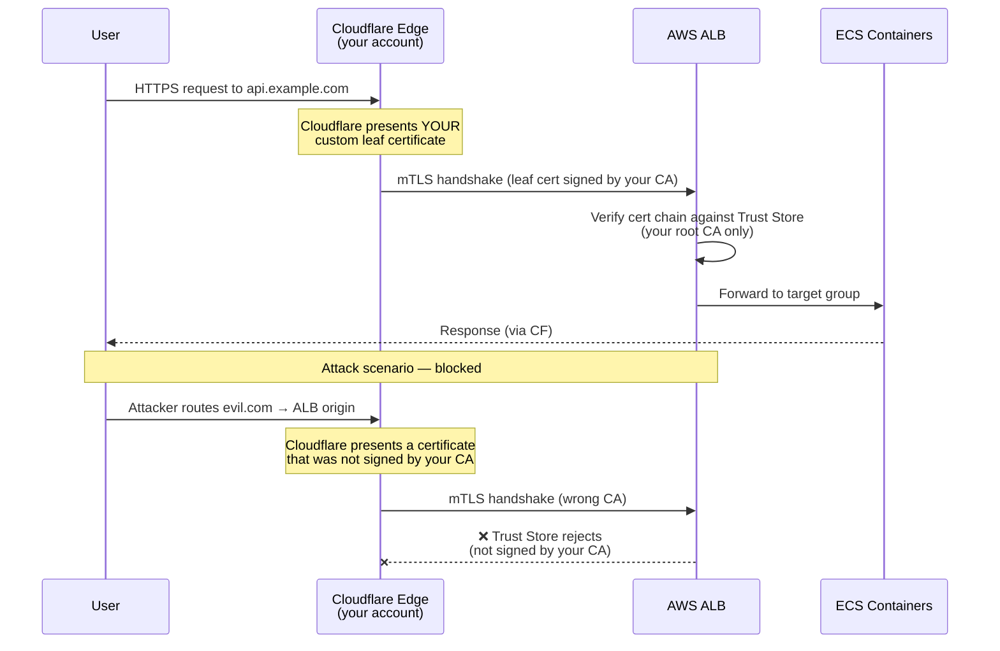

# AWS ALB mTLS (Trust Store) Module

This module provisions an AWS ALB Trust Store to enable mTLS (mutual TLS) authentication on an ALB listener. This is particularly useful for implementing **Cloudflare Authenticated Origin Pulls**.

## Overview

AWS ALB Trust Stores (`aws_lb_trust_store`) are required for verifying incoming client certificates (such as the certificate Cloudflare presents when proxying traffic to your origin). 

**Important limitation:** Trust Stores cannot use AWS Certificate Manager (ACM). ACM only stores *server* certificates (what the ALB presents to clients). Trust Stores *must* read CA certificate bundles from S3. This module creates a minimal, locked-down S3 bucket to store the provided CA bundle and creates the Trust Store from it.

## ⚠️ Rollout Warning

When enabling mTLS on an *existing* ALB, **deployment order matters**:
Adding `mutual_authentication` with `mode = "verify"` to an active ALB listener **immediately rejects all requests without a valid client certificate**. 

The safe rollout strategy is:
1. Generate your CA and leaf certificates (e.g., using `script/generate-mtls-certs.sh`).
2. Deploy the **Cloudflare** side first (upload the leaf cert, enable Authenticated Origin Pulls for the zone/hostname).
3. Deploy the **AWS** side with `alb_mtls_mode = "passthrough"`. Passthrough does not validate the client certificate; it forwards the presented certificate chain to the target in `X-Amzn-Mtls-Clientcert`.
4. Confirm through a diagnostic target or ALB connection logs that Cloudflare presents the expected client certificate. Do not treat passthrough as an access-control boundary.
5. Switch the AWS config to `alb_mtls_mode = "verify"` to enforce protection.

In `verify` mode the ALB terminates an invalid or certificate-less TLS connection before it becomes an HTTP request. Keep Cloudflare IP allowlisting as defense in depth, and keep the Cloudflare SSL mode at **Full (strict)**.

The CA private key is not required by Terraform or AWS, but it is required whenever a new Cloudflare client leaf certificate is issued. Keep it encrypted in a restricted administrator vault. The CA certificate is public material and is the only CA material uploaded to the ALB trust store.

## CA storage

`script/generate-mtls-certs.sh` encrypts `rootca.key` with AES-256. Set `MTLS_CA_PASSPHRASE` for non-interactive use; when run from a terminal, the script prompts for it instead:

```shell
MTLS_CA_PASSPHRASE="$passphrase" ./script/generate-mtls-certs.sh "*.example.com"
```

For projects using the restricted `${project}/terraform/${environment}` Secrets Manager vault, store these values there:

- `cloudflare_aop_ca_private_key_pem`: the encrypted contents of `rootca.key`.
- `cloudflare_aop_ca_private_key_passphrase`: the encryption passphrase.
- `cloudflare_aop_ca_certificate_pem`: the public `rootca.crt`, so CI can create renewed leaf certificates without another storage dependency.

The encrypted key and its passphrase may share this vault when access is already limited to the administrators and CI role authorized to manage infrastructure-level credentials. Do not pass the CA private key or its passphrase through a Terraform resource, data source, variable, or output: Terraform would copy the value into state. Create the vault with Terraform, then populate and read these fields through the AWS CLI or Secrets Manager API outside Terraform.

## Leaf certificate rotation

Cloudflare does not replace an expired custom Authenticated Origin Pulls certificate automatically. Configure Cloudflare's zone-level AOP certificate expiration notification, which warns 30 and 14 days before expiry, and rotate well before the first warning becomes urgent.

`script/rotate-mtls-certificates.sh` is a portable helper intended to be copied into a project's deployment repository or invoked from that repository's CI job:

```shell
export MTLS_CA_PASSPHRASE="$passphrase"
./script/rotate-mtls-certificates.sh \
  "*.example.com" \
  /tmp/cloudflare-aop/rootca.key \
  /tmp/cloudflare-aop/rootca.crt \
  /tmp/cloudflare-aop/renewed
```

An administrator-triggered or scheduled CI rotation should:

1. Assume a narrowly scoped deployment role and read the three CA values from `${project}/terraform/${environment}`.
2. Write the CA key and certificate to a private temporary directory, without logging their contents.
3. Run the rotation script to produce a new `cert.crt` and `cert.key` signed by the existing CA.
4. Persist the new leaf certificate and key wherever the normal Terraform CI job hydrates them, make those files available to the Terraform configuration, and run `terraform apply`. The Cloudflare certificate resource uses `create_before_destroy`, so it uploads and selects the new certificate before deleting the old one.
5. Verify proxied traffic succeeds and a direct request without a client certificate is rejected by the ALB.
6. Delete all temporary files.

Automate leaf rotation only. Root CA rotation requires an overlapping ALB trust-store rollout and remains a deliberate operation. The rotation script refuses to issue a leaf whose requested lifetime exceeds the remaining CA lifetime. See [Cloudflare's AOP certificate management guidance](https://developers.cloudflare.com/ssl/origin-configuration/authenticated-origin-pull/set-up/manage-certificates/).

## Architecture


