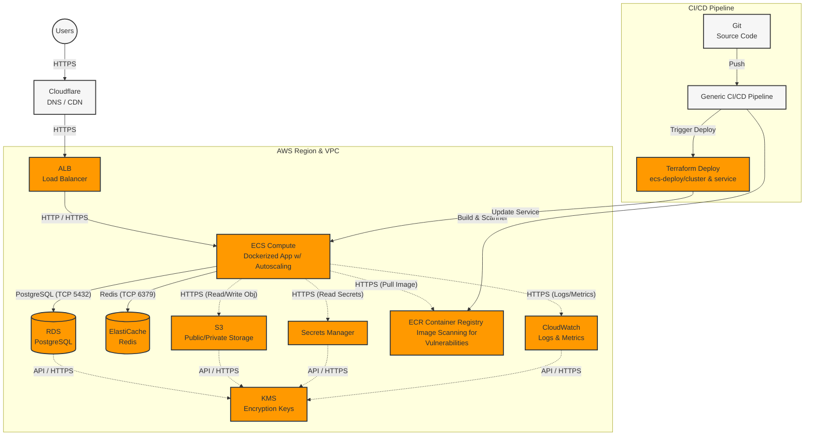
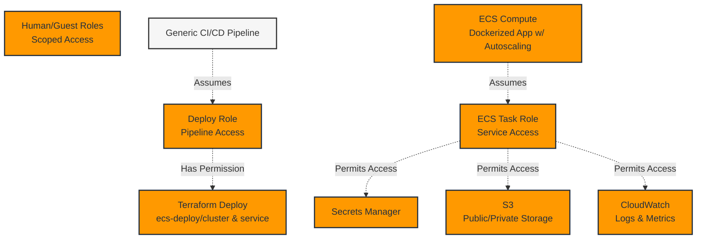
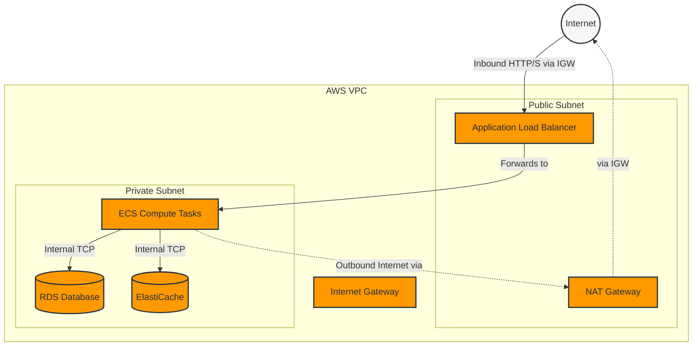
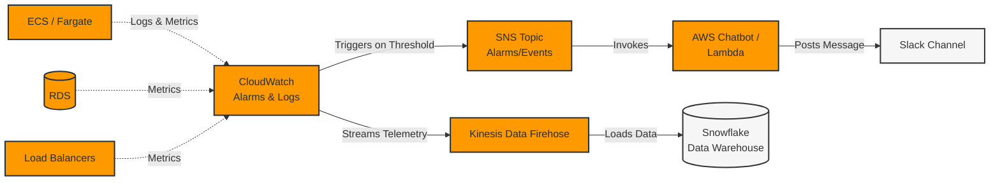

# AWS Architecture

The `aws/stack` is one such module in this repository that serves as an example of how these modules can be combined. It combines the resources one needs for a standard app that uses a postgres DB, redis, and runs a dockerized app in ECS.

## IAM Access Control

We utilize role-based access with only the minimum necessary privileges.

## Network Topology & Security

The environment generates a VPC containing isolated subnets. Incoming internet traffic must pass through the Load Balancer, while private resources like ECS tasks and Databases are placed in Private subnets with zero direct inbound internet access. Outbound traffic from the private subnet routes through an optional NAT Gateway.

## Monitoring & Alerting Flow

Comprehensive observability is integrated throughout the stack. Components push logs and metrics to CloudWatch, where thresholds and alarms trigger SNS Topics. These topics forward critical alerts via AWS Chatbot or Lambda directly into Slack.

We also integrate `cloudwatch-kinesis` and `cloudwatch-snowflake` to push telemetry data out of CloudWatch and into Snowflake for ultra-fast querying of metrics.

