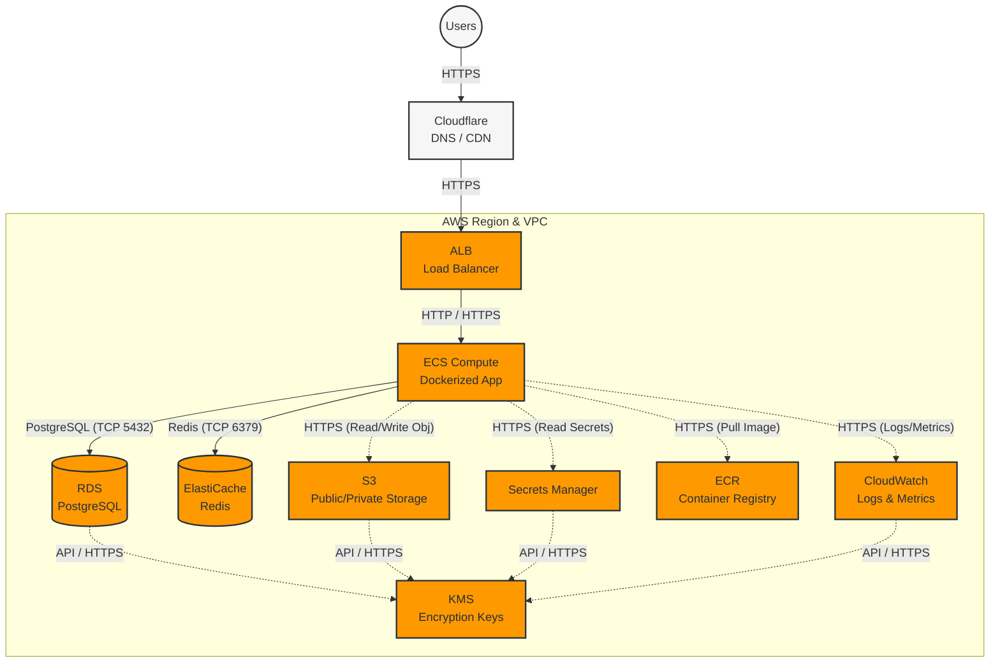

# AWS Stack Architecture

The `aws/stack` module combines the resources one needs for a standard app that uses a postgres DB, redis, and runs a dockerized app in ECS.

```mermaid
graph TD
    classDef aws fill:#FF9900,stroke:#232F3E,stroke-width:2px,color:#232F3E;
    classDef external fill:#f6f6f6,stroke:#333,stroke-width:2px;

    %% External entities
    Users((Users)):::external
    CF[Cloudflare <br/> DNS / CDN]:::external
    
    subgraph AWS_VPC [AWS Region & VPC]
        ALB[ALB <br/> Load Balancer]:::aws
        ECS[ECS Compute<br/>Dockerized App]:::aws
        RDS[(RDS<br/>PostgreSQL)]:::aws
        ElastiCache[(ElastiCache<br/>Redis)]:::aws
        
        SM[Secrets Manager]:::aws
        S3[S3 <br/> Public/Private Storage]:::aws
        KMS[KMS <br/> Encryption Keys]:::aws
        ECR[ECR <br/> Container Registry]:::aws
        CW[CloudWatch <br/> Logs & Metrics]:::aws
    end

    %% Connections
    Users -- "HTTPS" --> CF
    CF -- "HTTPS" --> ALB
    ALB -- "HTTP / HTTPS" --> ECS
    
    ECS -- "PostgreSQL (TCP 5432)" --> RDS
    ECS -- "Redis (TCP 6379)" --> ElastiCache
    
    ECS -. "HTTPS (Pull Image)" .-> ECR
    ECS -. "HTTPS (Read Secrets)" .-> SM
    ECS -. "HTTPS (Read/Write Obj)" .-> S3
    ECS -. "HTTPS (Logs/Metrics)" .-> CW
    
    %% KMS Dependencies
    RDS -. "API / HTTPS" .-> KMS
    S3 -. "API / HTTPS" .-> KMS
    SM -. "API / HTTPS" .-> KMS
    CW -. "API / HTTPS" .-> KMS
```
