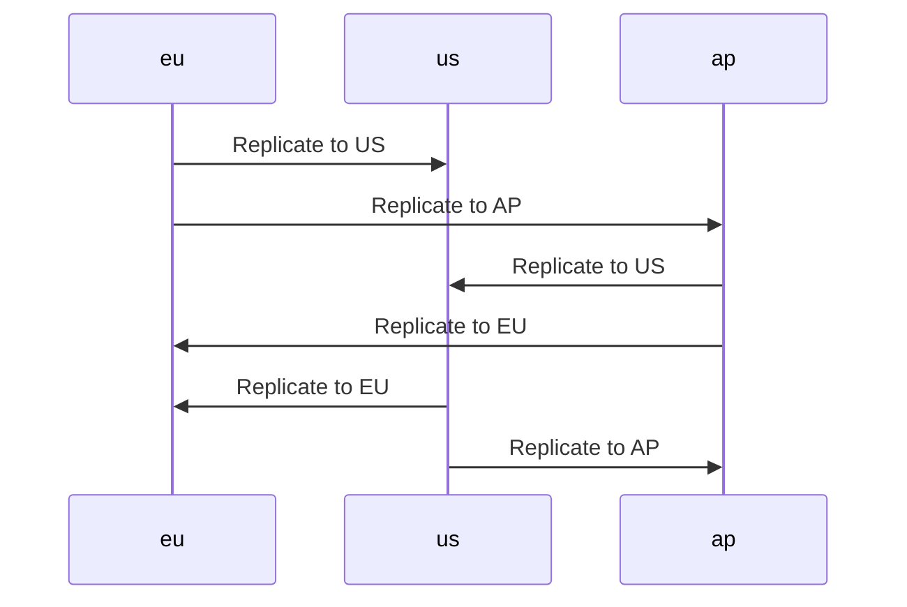

# Terraform Module: s3-storage

Standarized set up for a private, encrypted S3 bucket with versioning.
Used for any private files from an application, e.g. PDF files linked to a record.


## Usage

```terraform
module "s3-storage" {
  source = "github.com/dbl-works/terraform//s3-private?ref=v2021.11.13"

  # Required
  environment = "staging"
  project     = "someproject"
  bucket_name = "someproject-staging-storage"

  # Optional
  policy_allow_listing_all_buckets = true # Needed if we want to be able to browse the index page for buckets in the UI
  kms_deletion_window_in_days      = 30
  versioning                       = true
  cors_allowed_headers             = ["*"]
  cors_allowed_methods             = ["PUT", "POST"]
  cors_allowed_origins             = ["*"]
  cors_expose_headers              = ["ETag"]
  regional                         = false
  region                           = null   # IAM Policy Names must be unique across regions
  multi_region_kms_key             = false  # If true, the KMS key can be used in other regions
  name                             = ""     # used for policies, if null "project-environment-region" is used
  primary_storage_class_retention  = 0
  s3_replicas                      = [
    {
      bucket_arn = "arn:aws:s3:::staging-storage-us-east-1"
      kms_arn = "arn:aws:kms:us-east-1:111122223333:key/1234abcd-12ab-34cd-56ef-1234567890ab"
    }
   ]
}
```

### With replica
```terraform
module "s3-private" {
  source = "github.com/dbl-works/terraform//s3-private?ref=v2021.11.13"

  # Required
  environment = "staging"
  project     = "someproject"
  bucket_name = var.bucket_name

  # Optional
  kms_deletion_window_in_days     = 30
  versioning                      = true
  primary_storage_class_retention = 0
  s3_replicas = [
    {
      id = module.s3-replica-for-private-bucket-eu-central-1.id
      bucket_arn = module.s3-replica-for-private-bucket-eu-central-1.arn
      kms_arn = module.s3-replica-for-private-bucket-eu-central-1.kms-key-arn
      region  = "eu-central-1"
    },
    {
      id = module.s3-replica-for-private-bucket-us-east-1.id
      bucket_arn = module.s3-replica-for-private-bucket-us-east-1.arn
      kms_arn = module.s3-replica-for-private-bucket-us-east-1.kms-key-arn
      region  = "us-east-1"
    }
   ]
}

provider "aws" {
  alias  = "eu"
  region = "eu-central-1"
}

module "s3-replica-for-private-bucket-eu-central-1" {
  source = "github.com/dbl-works/terraform//s3-private?ref=v2021.11.13"
  providers = {
    aws = aws.eu
  }

  # Required
  environment = "staging"
  project     = "someproject"
  bucket_name = "${var.bucket_name}-eu-central-1"
  regional    = true
  region      = "eu-central-1"

  # Optional
  kms_deletion_window_in_days     = 30
  versioning                      = true
  primary_storage_class_retention = 0
  s3_replicas = [
    {
      id = module.s3-private.id
      bucket_arn = module.s3-private.arn
      kms_arn = module.s3-private.kms-key-arn
      region  = "ap-southeast-1"
    },
    {
      id = module.s3-replica-for-private-bucket-us-east-1.id
      bucket_arn = module.s3-replica-for-private-bucket-us-east-1.arn
      kms_arn = module.s3-replica-for-private-bucket-us-east-1.kms-key-arn
      region  = "us-east-1"
    }
   ]
}

provider "aws" {
  alias  = "us"
  region = "us-east-1"
}

module "s3-replica-for-private-bucket-us-east-1" {
  source = "github.com/dbl-works/terraform//s3-private?ref=v2021.11.13"
  providers = {
    aws = aws.us
  }

  # Required
  environment = "staging"
  project     = "someproject"
  bucket_name = "${var.bucket_name}-us-east-1"
  regional    = true
  region      = "us-east-1"

  # Optional
  kms_deletion_window_in_days     = 30
  versioning                      = true
  primary_storage_class_retention = 0
  s3_replicas = [
    {
      id = module.s3-private.id
      bucket_arn = module.s3-private.arn
      kms_arn = module.s3-private.kms-key-arn
      region  = "ap-southeast-1"
    },
    {
      id = module.s3-replica-for-private-bucket-eu-central-1.id
      bucket_arn = module.s3-replica-for-private-bucket-eu-central-1.arn
      kms_arn = module.s3-replica-for-private-bucket-eu-central-1.kms-key-arn
      region  = "eu-central-1"
    }
   ]
}
```

### Replica Diagram


## Outputs

- `arn`: you probably want to pass this arn to ECS `grant_write_access_to_s3_arns`
- `kms-key-arn`: you probably want to pass this arn to ECS `kms_key_arns`
- `group-usage-name`: name of the AWS IAM group to grant usage permissions to the bucket
